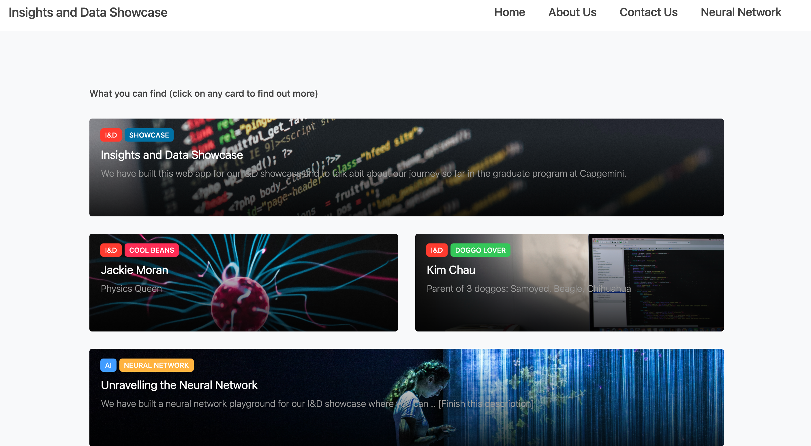
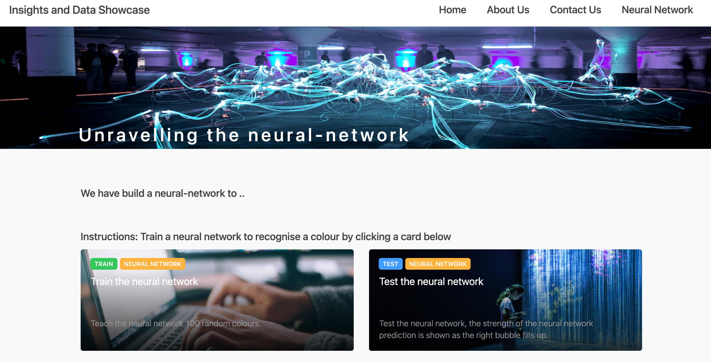
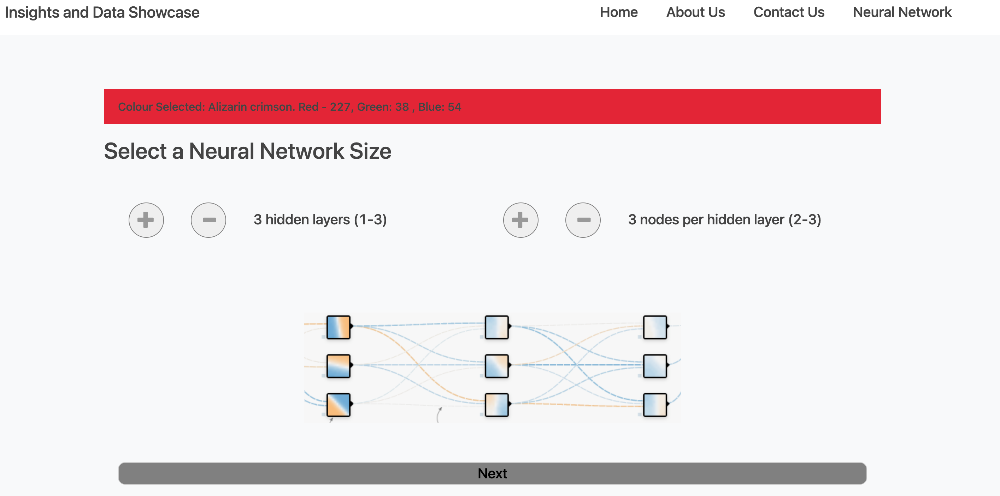

# Unravelling the Neural Network

## Overview

Project created by Kim Chau and Jackie Moran as part of Capgemini's Graduate Program in 2020 for the Insights & Data showcase.
Combining their interests, Software Engineering (Kim) and Data Science (Jackie) to build a web application to unravel the neural network.

Together, we have built a 'neural network playground' where you can train the neural network using 100 random colours then test the neural network. The strength of the neural network prediction is shown as the right bubble fills up. Training set of colours were collected from this website Rapid tables.

* Kim - Full stack development (React + Flask)
* Jackie - Developed the neural network from the ground up (Python)

## Screenshots 

### Home Page - 



### Neural Network page - 



### Train Neural Network page preview - 



## Prerequisites

Before you begin, ensure you have met the following requirements:

* Node.js
* yarn
* python3
* python-dotenv
* flask

## Installing the react-flask-app

To install react-flask-app follow these steps:

```
git clone <repo>
```
If it is your first time cloning: 
```
cd neural_net/react-flask-app/api
```
Run these commands
```
python3 -m venv venv
. venv/bin/activate
pip install flask python-dotenv
```
On Windows:
```
py -3 -m venv venv
venv/Scripts/activate
pip install flask python-dotenv
```
* creates virtual environment inside the api directory
* activates the environment
* installs flask and python-dotenv

## To run the application:
```
cd react-flask-app
npm install
yarn start
yarn start-api
```

Notes for running the app:
* yarn start - runs the frontend
* yarn start-api - runs the flask backend

## Contributing to 'Visualising the Neural Network'

To contribute to neural network, follow these steps:

1. Create a branch: `git checkout -b <branch_name>`.
2. Make your changes and commit them: `git commit -m '<commit_message>'`
3. Push to the original branch: `git push origin <project_name>/<location>`
4. Create the pull request.